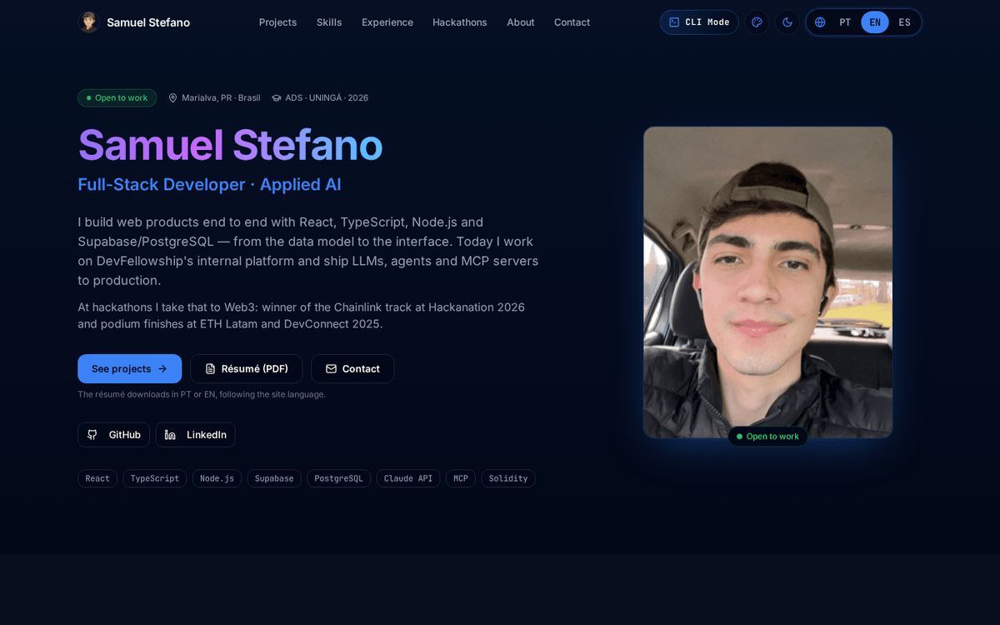
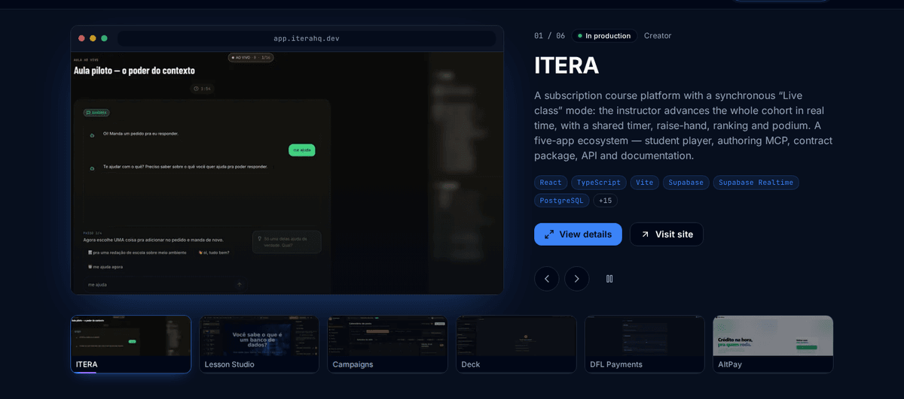
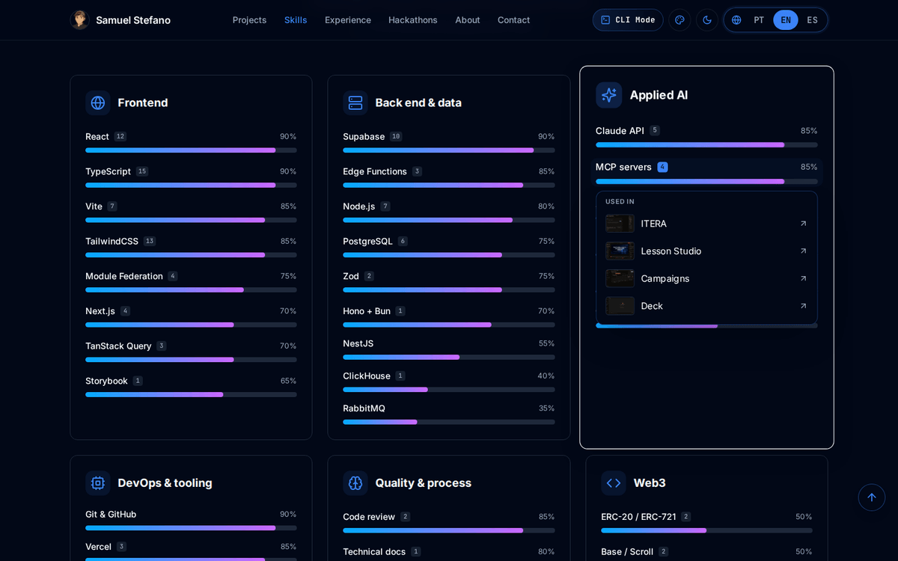
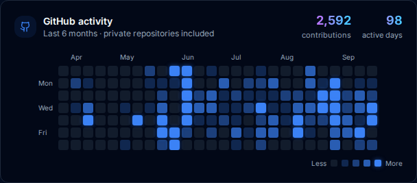
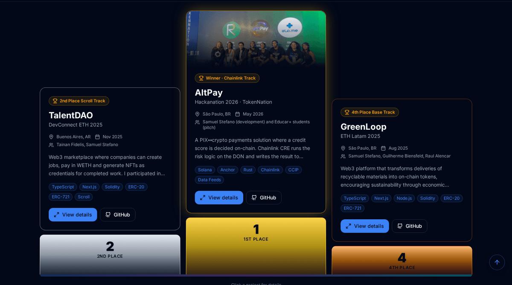

<div align="center">

# Samuel Stefano — Portfolio

**Full-stack developer · applied AI** — React, TypeScript, Node.js and Supabase, with LLMs, agents and MCP servers in production.

[](https://samuelstefano.dev)
[](https://github.com/SamuelStefano/Portfolio/actions/workflows/ci.yml)


<a href="https://samuelstefano.dev"></a>

</div>

## What is in it

**Featured projects** — six flagship projects in a showcase: screenshot in a browser frame, status, role, stack and links. Autoplay is driven by the progress bar of the active thumbnail and pauses on hover, keyboard focus, when the carousel leaves the screen, when the tab is hidden and under `prefers-reduced-motion`; swipe and arrow keys work too. Every project opens a detail view with a sectioned gallery and a lightbox.



**Skills backed by evidence** — each skill shows how many projects use it; clicking opens the list, and each project opens its detail view. The mapping is derived from the projects' stacks, not typed by hand ([`src/lib/skillProjects.ts`](src/lib/skillProjects.ts), unit-tested).



**Live GitHub activity** — a Vercel function reads the last year of contributions through GitHub GraphQL with a server-side token and is cached at the edge for six hours. The About section shows commits and merged pull requests, plus a six-month heatmap coloured by quartiles so one huge day does not wash the rest out.



**Hackathons as a podium**, a timeline of experience, a trilingual interface (Portuguese, English, Spanish), a terminal skin, four colour schemes and a light theme — all applied before the first paint.



## Engineering notes

| | |
|---|---|
| **Performance** | Initial JavaScript is 108 KB gzip (it was 221 KB). The project overlay (with framer-motion), terminal skin, snake game, award dialog and 404 page are separate chunks; cards warm the overlay chunk on hover. Each visitor downloads one locale and the others load when the browser is idle. Photos ship as WebP variants sized for where they render. |
| **Content model** | [`projectCatalog.ts`](src/lib/projectCatalog.ts) holds structure only (links, stack, images, status). Every sentence a visitor reads lives in [`src/locales`](src/locales), so a text exists once per language. |
| **Security** | Strict CSP (the single inline script is allow-listed by hash), HSTS, frame and content-type headers. Tokens stay in serverless functions; CI fails if anything shaped like a key reaches `dist/`. |
| **Accessibility** | Keyboard focus is always visible, skip link, carousel follows the WAI-ARIA pattern with a pause control, the project view is a real modal (the page behind goes inert, focus moves in and returns to where it came from), `<html lang>` follows the chosen language, reduced motion is respected everywhere. |
| **Resilience** | A lazily loaded piece that fails to download loses only itself, never the page (error boundaries); a tab left open across a deploy reloads once to pick up the new chunks. A partial answer from GitHub is cached for a minute instead of six hours, and the page never shows a zero where GitHub failed to answer. |
| **Quality gates** | `npm run check` = typecheck + lint + tests + build, also on every push in GitHub Actions (read-only token, actions pinned by SHA). |

The tests guard the things that silently break a portfolio: an image path that does not exist, a project text missing in one language, locales drifting apart (keys, list lengths, `{{placeholders}}`), the CSP hash falling out of sync with the inline script, the heatmap maths and the skill ↔ project matching.

## Stack

React 18 · TypeScript · Vite · Tailwind CSS · Radix UI (dialog) · framer-motion (overlay only) · i18next · Vitest · Storybook · Vercel (static site + serverless functions) · sharp (image pipeline)

## Structure

```
src/
  components/   atoms · molecules · organisms (atomic design)
  hooks/        view state: in-view, reduced motion, GitHub stats, theme, skin
  lib/          pure logic: catalog, translation, skills ↔ projects, contributions, language
  locales/      pt · en · es — every text a visitor reads
  pages/        index and 404
api/            Vercel functions: github-stats, IP-gated visit log
scripts/        image pipeline (sharp → thumb/card WebP variants)
public/         screenshots, photos, résumés, share card
```

## Running it

```bash
npm install
npm run dev            # http://127.0.0.1:8080 — /api/github-stats is proxied to production
npm run check          # typecheck, lint, tests, build
npm run images         # regenerate WebP variants after adding screenshots
npm run dev:vercel     # run the API functions locally (Vercel CLI + env)
```

Offline, point the stats endpoint at a saved response: `GITHUB_STATS_FIXTURE=stats.json npm run dev`.

| Environment variable | Where | Used by |
|---|---|---|
| `GITHUB_TOKEN` | Vercel (server) | `api/github-stats` — fine-grained, read-only |
| `ADMIN_IP` | Vercel (server) | `api/check-access`, `api/log` — the visit-log gate fails closed without it |
| `SUPABASE_URL`, `SUPABASE_SERVICE_ROLE_KEY` | Vercel (server) | `api/log` |

Nothing is read from `VITE_*` variables: anything with that prefix would be inlined into the public bundle.

## Adding a project

1. Put the screenshots in `public/projects/<slug>/` and run `npm run images`.
2. Add the entry to `src/lib/projectCatalog.ts` and its status (and `featured`) to `PROJECT_META`.
3. Add its key to `src/lib/translateProjects.ts` and the texts to the three locales under `projectDescriptions.<key>` and `projectSectionText.<section id>`.
4. `npm test` — the catalog test lists anything that is missing.

---

The code is public to read and learn from. Photos, texts and project material are personal — please don't reuse them.
